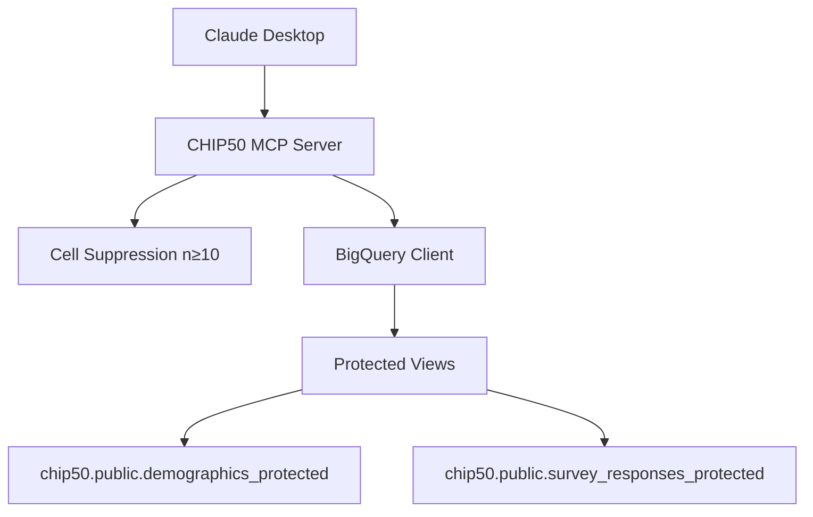

# CHIP50 Survey MCP

**Privacy-preserving survey data analysis for Claude Desktop**


---

## What is CHIP50 MCP?

CHIP50 MCP is a **Model Context Protocol (MCP) server** that provides privacy-protected access to CHIP50 survey data through Claude Desktop. It enables researchers and journalists to analyze public opinion data with built-in privacy protections.

### Key Features

✅ **Privacy-First Design**
- Automatic cell suppression (n≥10)
- Geographic aggregation (states → regions)
- No access to personally identifiable information
- Protected BigQuery views

✅ **Easy Installation**
- One-command automated installer
- Works on macOS, Linux, and Windows
- No manual configuration needed

✅ **Powerful Analysis**
- Weighted cross-tabulations
- Survey-wave filtering
- Demographic breakdowns
- Direct BigQuery integration

✅ **Claude Desktop Integration**
- Native MCP protocol support
- Natural language queries
- Interactive data exploration
- Automatic privacy enforcement

---

## Quick Start

### Install in 3 Steps

=== "macOS/Linux"

    ```bash
    # 1. Download the bundle
    curl -LO https://github.com/nanocentury-ai/chip50MCP/releases/latest/download/chip50-survey-mcp-v2.0.0.mcpb

    # 2. Run the installer
    ./install.sh

    # 3. Restart Claude Desktop
    ```

=== "Windows"

    ```powershell
    # 1. Download the bundle
    Invoke-WebRequest -Uri "https://github.com/nanocentury-ai/chip50MCP/releases/latest/download/chip50-survey-mcp-v2.0.0.mcpb" -OutFile "chip50-survey-mcp-v2.0.0.mcpb"

    # 2. Run the installer
    .\install.ps1

    # 3. Restart Claude Desktop
    ```

### First Query

After installation, ask Claude:

> "What variables are available in the CHIP50 dataset?"

Claude will show you all available demographic and survey variables with privacy protection details.

---

## Example Usage

### Discover Data

```
You: What survey variables are available?
```

Claude calls `get_available_variables()` and shows:
- 8 demographic variables (region, age, education, party, etc.)
- 12 survey variables (trust scales, approval ratings, etc.)
- Privacy protections (cell suppression, no PII)

### Generate Cross-Tabulation

```
You: Show me trust in Congress by party affiliation
```

Claude generates a privacy-protected crosstab with:
- Weighted counts and percentages
- Automatic cell suppression for small groups
- Clear privacy metadata

### Filter by Wave

```
You: Show vote intention by region for wave 9 only
```

Results filtered to specific survey wave with privacy protections applied.

---

## What's Inside

### Privacy Protections

| Protection | How It Works |
|------------|-------------|
| **Cell Suppression** | Cells with n<10 automatically hidden |
| **Geographic Aggregation** | States grouped into 5 regions |
| **No User IDs** | Non-reversible hashes for joins |
| **Protected Views** | Only privacy-safe data accessible |

### Available Data

**Demographics:**
- Region (5 categories)
- Age (8 categories)
- Education (5 levels)
- Income (10 brackets)
- Party ID (7-point scale)
- Race/ethnicity
- Gender
- Urban/rural

**Survey Questions:**
- Trust in institutions (Congress, courts, media, military)
- Political approval ratings (president, governor, senator)
- Issue importance (economy, healthcare)
- Voting intention and registration
- Party thermometer (0-100)

**Sample:**
- 500 unique respondents
- 3 survey waves (7, 8, 9)
- 1,500 total observations
- Survey-weighted for population estimates

---

## Architecture



**Key Points:**
- ✅ Everything runs locally (no remote server)
- ✅ Direct BigQuery access to protected views
- ✅ Privacy enforced at multiple layers
- ✅ Uses your own Google Cloud credentials

---

## Documentation

### Getting Started
- [Quick Start Guide](getting-started/quickstart.md) - Get up and running in 5 minutes
- [Installation Guide](getting-started/installation.md) - Complete installation instructions
- [First Steps](getting-started/first-steps.md) - Your first queries

### User Guide
- [Using the MCP Server](user-guide/usage.md) - How to use with Claude Desktop
- [Available Variables](user-guide/variables.md) - All demographic and survey variables
- [Cross-Tabulation](user-guide/crosstabs.md) - Generate and interpret crosstabs
- [Privacy Protections](user-guide/privacy.md) - Understanding privacy features

### Installation by Platform
- [Complete Installation Guide](install/complete-guide.md) - All methods and platforms
- [macOS Installation](install/macos.md) - Mac-specific instructions
- [Linux Installation](install/linux.md) - Linux-specific instructions
- [Windows Installation](install/windows.md) - Windows-specific instructions
- [Troubleshooting](install/troubleshooting.md) - Common issues and solutions

### Technical Documentation
- [Architecture Overview](technical/architecture.md) - System design
- [Build Plan](technical/buildplan.md) - Complete technical specification
- [Privacy Implementation](technical/privacy-implementation.md) - How privacy works
- [Cross-Platform Support](technical/cross-platform.md) - Platform compatibility

---

## Requirements

### System Requirements

| Component | Requirement |
|-----------|-------------|
| **Operating System** | macOS, Linux, or Windows |
| **Python** | 3.10 or higher |
| **UV** | Latest version |
| **Google Cloud SDK** | Latest version |
| **Claude Desktop** | Latest version |

### Google Cloud Setup

1. Google Cloud account
2. Access to BigQuery project `chip50`
3. Application default credentials configured

---

## Support

### Get Help

- **Installation Issues:** See [Troubleshooting Guide](install/troubleshooting.md)
- **Usage Questions:** Check [User Guide](user-guide/usage.md)
- **Bug Reports:** [GitHub Issues](https://github.com/nanocentury-ai/chip50MCP/issues)
- **Discussions:** [GitHub Discussions](https://github.com/nanocentury-ai/chip50MCP/discussions)

### Check Installation

Run the installation checker:

```bash
./check_install.sh
```

This verifies all components are correctly installed and configured.

---

## License

MIT License - See [LICENSE](https://github.com/nanocentury-ai/chip50MCP/blob/main/LICENSE) for details.

---

## Quick Links

- [Download Latest Release](https://github.com/nanocentury-ai/chip50MCP/releases/latest)
- [View on GitHub](https://github.com/nanocentury-ai/chip50MCP)
- [Report an Issue](https://github.com/nanocentury-ai/chip50MCP/issues/new)
- [Project Status](development/status.md)

---

**Ready to get started?** → [Quick Start Guide](getting-started/quickstart.md)
